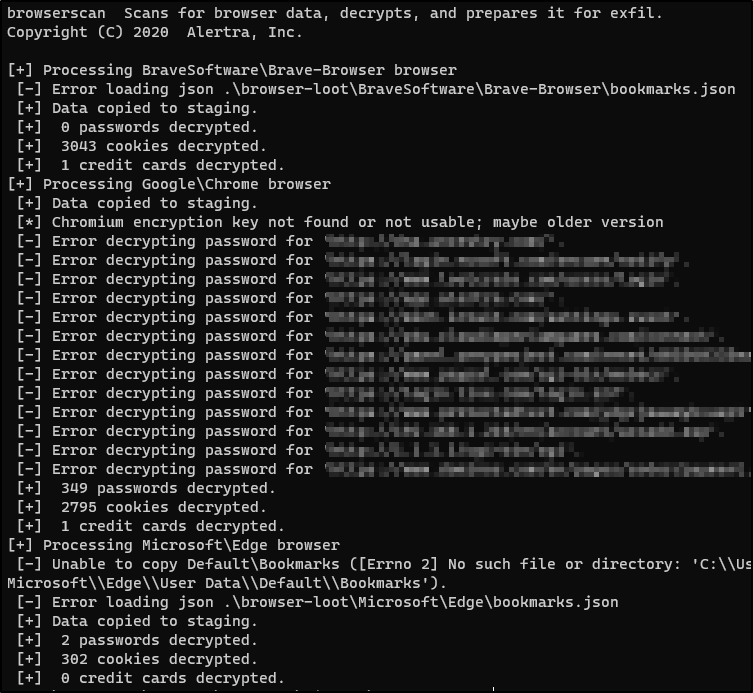

# BrowserScan

BrowserScan is a Windows tool that looks for Chromium based browser installs, loots relevant data, decrypts data it can, and gets everything ready for exfil. This tool was designed for penetration testing environments where you have a user login shell and are looking to either escalate privileges or gain credentials on other systems. This tool works on modern Chromium browsers that use more than plain DPAPI encryption to protect data.

Chromium based browsers include Chromium itself (which probably has very low install base) as well as:

* Google Chrome
* Microsoft Edge
* Brave Software Brave Browser
* Opera

For a more more complete list see [this](https://en.wikipedia.org/wiki/Chromium_(web_browser)#Browsers_based_on_Chromium) Wikipedia entry. The tool has been tested on Google Chrome (older version, plus recent builds), Edge, and Brave.

The tool first scans the user's AppData\Local folder and below looking for key files that indicate a Chromium based browser. It then creates a directory in the current directory called "browser-loot" and begins copying useful files from the browser install to the loot directory. Examples of loot files are:

* bookmarks.json 
* state.json - The browsers global configuration.
* history.sqlite3 - Download and link history
* chromekey.bin - Chrome encryption key
* plaintext-cookies.csv
* plaintext-passwords.csv
* plaintext-ccards.csv

It's those last 3 that are probably the most interesting. That data is stored in encrypted form by the browser, but BrowserScan decrypts the data. Since Chromium uses DPAPI which bases encryption off the user's login password, BrowserScan will only be able to decrypt the data if you run under an actual login session. 

## Installation

### Easy

Just copy the dist\browserscan.exe to your target and run it. 

### Harder

BrowserScan was developed with Python 3. It might work with Python 2, but it hasn't been tested. Once you have installed Python 3 you can install this tools requirements by:

```` bash 
python -m pip install -r requirements.txt
````

or if that doesn't work:

```` bash
pip install -r requirements.txt
````

You can recreate the executable with:

```` bash
pip3 install pyinstaller
pyinstaller --onefile src/browserscan.py
````

Some virus scanners are currently mistakenly flagging pyinstaller created executables as having a virus. Even a "Hello World" app. A possible fix for that is leaving off the "onefile" parameter. You'll need to copy all of the files in "dist" to your target to run the tool, but you may not get the virus warning.

## Usage

There are no command line arguments, BrowserScan is just going to do it's thing looking around the current user's AppData\Local directory. Output will show up in ".\browser-loot". Your output will probably look similar to this (except the user probably doesn't have 3 browsers installed):



The "Error decrypting password" messages may be caused by a user having their password reset by an administrator. That is a rare event, but because of how the passwords are handled by Chromium if the password is reset by the Admin, then all of the passwords stored with the old password are undecryptable.

## Decryption

Decrypting data stored by the Chromium based browser works 1 of 2 different ways. The old way which relies solely on Microsoft's DPAPI cryptography DLL and the new way which still uses DPAPI, but adds some extra crypto on top. 

You don't have to worry about that though. The tool will detect what encryption is being used and decrypt accordingly. 

If I've missed something that is encrypted and it needs decrypting, take a look at the "decrypt_ciphertext" method of the ChromiumScanner class. Once you have called the scanner's "enum_browsers" method you can use the "decrypt_ciphertext" method to decrypt anything the browser has encrypted.
